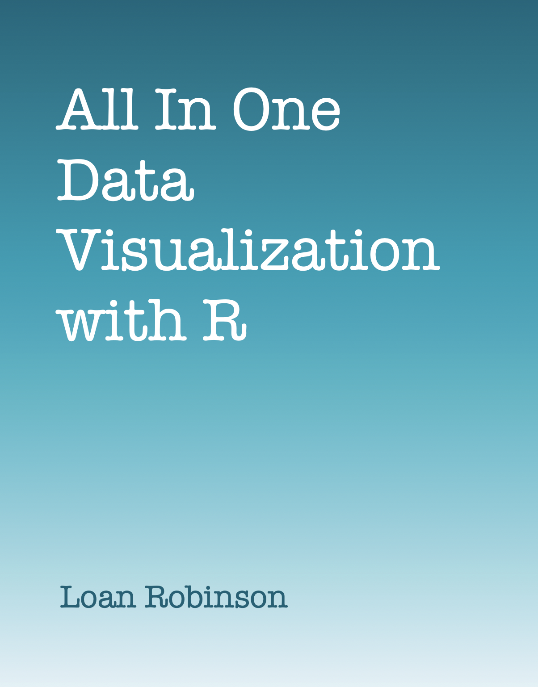

```{r setup, include=FALSE}
#source("style.R")
library(knitr)
# global chunk options
opts_chunk$set(
  message = FALSE, 
  warning = FALSE, 
  comment = "#>",
  collapse = TRUE,
  cache = TRUE,
  class.source="Rchunk", 
  class.output="Rout", 
  fig.show = "hold",
  fig.align = "center"
)

```


```{r global_options, include=FALSE, warning=FALSE, message = FALSE, echo=FALSE}
library(formatR)
knitr::opts_chunk$set(tidy.opts=list(width.cutoff=40), tidy = TRUE)
knitr::opts_chunk$set(knitr.graphics.auto_pdf = FALSE)
```


```{r wrap-hook, echo=FALSE}
# Wrap the long sentences
library(knitr)
hook_output = knit_hooks$get('output')
knit_hooks$set(output = function(x, options) {
  # this hook is used only when the linewidth option is not NULL
  if (!is.null(n <- options$linewidth)) {
    x = knitr:::split_lines(x)
    # any lines wider than n should be wrapped
    if (any(nchar(x) > n)) x = strwrap(x, width = n)
    x = paste(x, collapse = '\n')
  }
  hook_output(x, options)
})
```


# {-}

```{r , echo = FALSE,dpi=250,fig.width= 10,fig.height=13,out.width="100%",fig.align='center'}

```


# Preface {-}


## About this book {-}


## What you will gain {-}


## Prerequisites {-}


